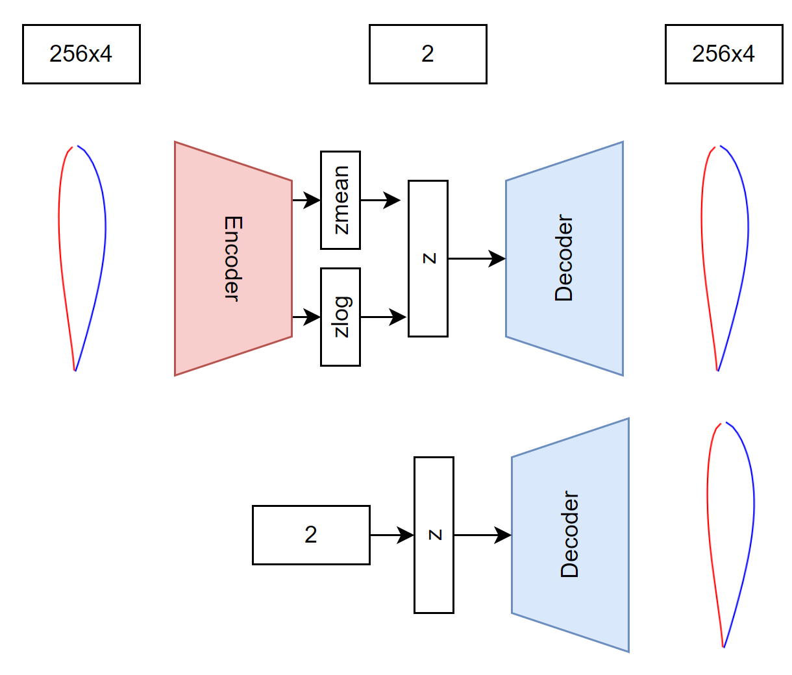

# Neural Airfoil Generator

Generate airfoils with the help of a varational autoencoder VAE.

- Uses public database

- Training of a VAE to predict shapes

You can specify the following parameters:
- `--ih`: Resolution of pressure and suction side (int)
- `--learnRate`: learning rate (float)
- `--testTrainSplit`: Test train split (float)
- `--epochs`: number of training epochs (int)
- `--latentDim`: latent dimensions (int)
- `--batchSize`: batch size (int)

.
.

## Requirements

Install the requirements with:

`pip install -r requirements.txt`

## Get the dataset

Data are taken from here: [Illinois Airfoil Database](https://m-selig.ae.illinois.edu/ads/coord_database.html).

To prepare the dataset run from project root dir:

    python3 ./data/prepareDownload.py

This script will download all .dat files and place them in ./data/raw. For more information on the download script see here: [Josh the engineer](https://www.youtube.com/watch?v=nILo18DlqAo). To prepare the raw data run

    python3 ./data/prepareRawData.py

in the same folder (./data). This will generated a json file for each .dat file with the following structure:

    name: "name of the airfoil",
    ss: [List x coordinates, List y coordinates],
    ps: [List x coordinates, List y coordinates],

## Training

To train the variational autoencoder run 

    python training/train.py

By default, the model is trained with a batch norm of 8, learning rate of 1e-4, 3000 epochs and saved as `weights-cpk.h5`.

    __________________________________________________________________________________________________
    Layer (type)                   Output Shape         Param #     Connected to
    ==================================================================================================
    rgb (InputLayer)               [(None, 256, 4)]     0           []

    encoder (Functional)           [(None, 2),          1580        ['rgb[0][0]']
                                    (None, 2),
                                    (None, 2)]

    decoder (Functional)           (None, 256, 4)       500         ['encoder[0][2]']

    conv1d (Conv1D)                (None, 256, 12)      156         ['rgb[0][0]']

    average_pooling1d (AveragePool  (None, 128, 12)     0           ['conv1d[0][0]']
    ing1D)

    conv1d_1 (Conv1D)              (None, 128, 8)       296         ['average_pooling1d[0][0]']

    conv1d_2 (Conv1D)              (None, 128, 4)       100         ['conv1d_1[0][0]']

    average_pooling1d_2 (AveragePo  (None, 64, 4)       0           ['conv1d_2[0][0]']
    oling1D)

    flatten (Flatten)              (None, 256)          0           ['average_pooling1d_2[0][0]']

    dense_1 (Dense)                (None, 2)            514         ['flatten[0][0]']

    dense (Dense)                  (None, 2)            514         ['flatten[0][0]']

    tf.math.subtract (TFOpLambda)  (None, 256, 4)       0           ['rgb[0][0]',
                                                                    'decoder[0][0]']

    tf.__operators__.add (TFOpLamb  (None, 2)           0           ['dense_1[0][0]']
    da)

    tf.math.square_1 (TFOpLambda)  (None, 2)            0           ['dense[0][0]']

    tf.math.square (TFOpLambda)    (None, 256, 4)       0           ['tf.math.subtract[0][0]']

    tf.math.subtract_1 (TFOpLambda  (None, 2)           0           ['tf.__operators__.add[0][0]',
    )                                                                'tf.math.square_1[0][0]']

    tf.math.exp (TFOpLambda)       (None, 2)            0           ['dense_1[0][0]']

    tf.math.reduce_sum (TFOpLambda  ()                  0           ['tf.math.square[0][0]']
    )

    tf.math.subtract_2 (TFOpLambda  (None, 2)           0           ['tf.math.subtract_1[0][0]',
    )                                                                'tf.math.exp[0][0]']

    tf.math.multiply (TFOpLambda)  ()                   0           ['tf.math.reduce_sum[0][0]']

    tf.math.reduce_sum_1 (TFOpLamb  (None,)             0           ['tf.math.subtract_2[0][0]']
    da)

    tf.math.truediv (TFOpLambda)   ()                   0           ['tf.math.multiply[0][0]']

    tf.math.multiply_1 (TFOpLambda  (None,)             0           ['tf.math.reduce_sum_1[0][0]']
    )

    tf.__operators__.add_1 (TFOpLa  (None,)             0           ['tf.math.truediv[0][0]',
    mbda)                                                            'tf.math.multiply_1[0][0]']

    tf.math.reduce_mean (TFOpLambd  ()                  0           ['tf.__operators__.add_1[0][0]']
    a)

    add_loss (AddLoss)             ()                   0           ['tf.math.reduce_mean[0][0]']

    ==================================================================================================
    Total params: 2,080
    Trainable params: 2,080
    Non-trainable params: 0
    __________________________________________________________________________________________________

## Inference

You can test your model using the file `inference.ipynb`. Use the following prompt to predict the rotation of a specific image:

