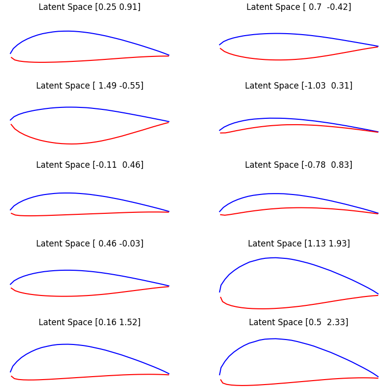

# Neural Airfoil Generator

Generate airfoils with the help of a varational autoencoder VAE.

- Uses public database

- Training of a VAE to predict shapes

You can specify the following parameters:
- `--ih`: Resolution of pressure and suction side (int)
- `--learnRate`: learning rate (float)
- `--testTrainSplit`: Test train split (float)
- `--epochs`: number of training epochs (int)
- `--latentDim`: latent dimensions (int)
- `--batchSize`: batch size (int)

.

## Requirements

Install the requirements with:

`pip install -r requirements.txt`

## Get the dataset

Data are taken from here: [Illinois Airfoil Database](https://m-selig.ae.illinois.edu/ads/coord_database.html).

To prepare the data set move to ./data

    cd data
    python3 prepareDownload.py

This script will download all .dat files and place them in ./data/raw. For more information on the download script see here: [Josh the engineer](https://www.youtube.com/watch?v=nILo18DlqAo). To prepare the raw data run

    python3 prepareRawData.py

in the same folder (./data). This will generated a json file for each .dat file with the following structure:

    name: "name of the airfoil",
    ss: [List x coordinates, List y coordinates],
    ps: [List x coordinates, List y coordinates],

## Training

To train the variational autoencoder run 

`python training/train.py`

By default, the model is trained with a batch norm of 8, learning rate of 1e-4, 3000 epochs and saved as `weights-cpk.h5`.

 the saved model (str)

## Inference

You can test your model using the file `inference.ipynb`. Use the following prompt to predict the rotation of a specific image:

